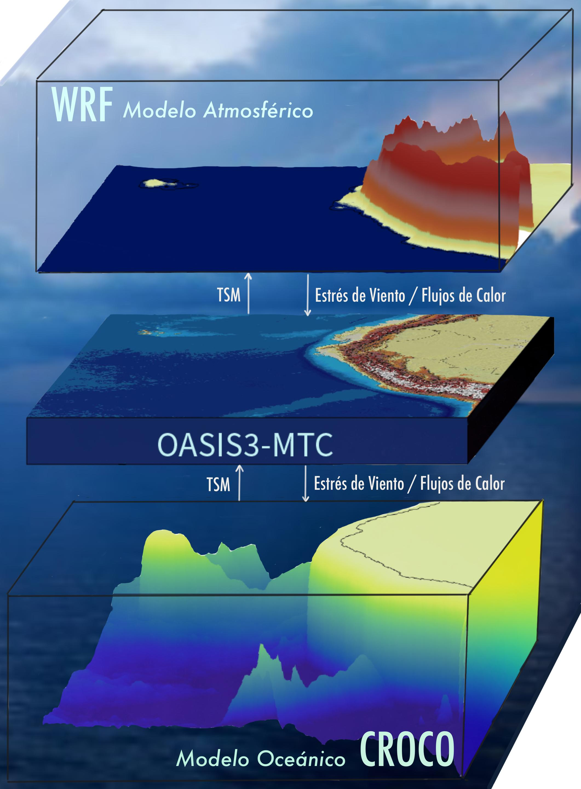

# SCAHpy

## **What is SCAHpy?**

***SCAHpy*** is an open-source Python package that facilitate the analysis and visualization of the ouputs from atmospheric, oceaninc and hydrological component from the Geophysical Institute of Peru Regional Earth System Model Croco-Oasis-WRF (IGP-RESM-COW)



## **Why is SCAHpy?**

Atmospheric component of the coupled model generate a large volumes of output data, making the analysis of model data harder. SCAHpy facilitates the manage of this volumes of data, also enables a manage of coordinates and times to local times. 

## **How to use SCAHpy?**

SCAHpy can be used as a standalone package or it can also be run on the HPC-IGP-Cluster, which has the diagnostic simulations of 22 years of runnings centered on Peru Region. 

::: {.callout-note}
SCAHpy has been developed and tested using IGP-RESM-COW model outputs. However, it is designed to work with any WRF outputs. We are open to contributions from users!
:::


# Documentation

The official documentation is hosted here: [Documentation](https://fiorelacl.github.io/SCAHpy/)

## Installation

1. First, download and install mamba or miniconda through [Miniforge](https://github.com/conda-forge/miniforge) .

2. The easiest way to install SCAHpy and the above mentioned dependencies is to use the conda-forge channel. Open a terminal, then run the following command:

```default
$ mamba create -n scahpy_env scahpy xarray wrf-python metpy
```

The commands above install the latest stable release of SCAHpy.

Checkout the contribution page if you want to get involved and help maintain or develop SCAHpy.
